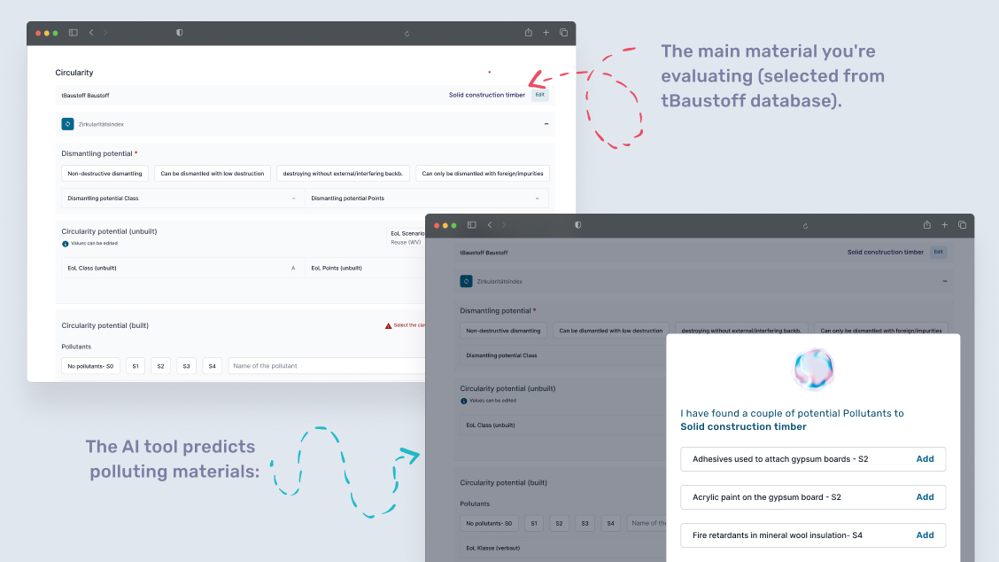
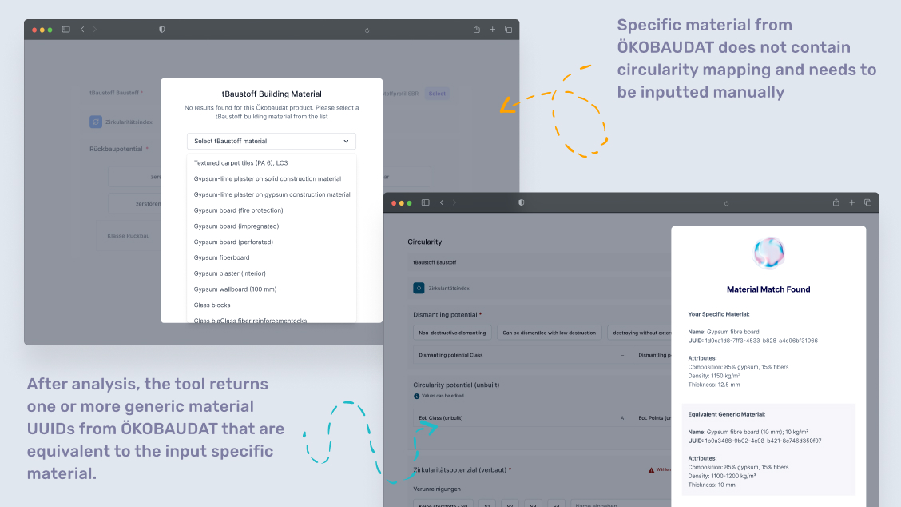
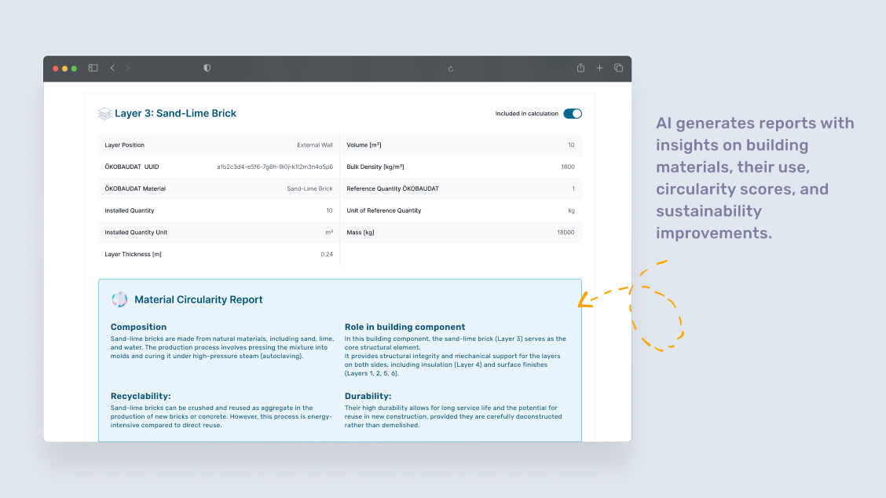

# Enhancing Circular Construction in Germany (with BBSR)

## Challenge Overview

This challenge focuses on improving circular construction practices by leveraging AI to analyze building material data from Germany's standardized database for ecological evaluations.

BBSR (Federal Institute for Research on Building, Urban Affairs and Spatial Development) is dedicated to promoting sustainable construction practices through standardized ecological evaluations. Their ÖKOBAUDAT database serves as Germany's official resource for life cycle assessment data in the building sector.

✅ Standardized ecological evaluation – A comprehensive database of building materials and their environmental impacts throughout their lifecycle.

✅ Government-backed research – Supported by the Federal Ministry for Housing, Urban Development and Building (BMWSB) to ensure reliable, high-quality data.

✅ Sustainability-focused – Enabling better decision-making for more environmentally friendly and resource-efficient construction.

This challenge is provided in collaboration with N3XTCODER.

 

The challenge splits into three primary goals:

1. **Material Connection & Disturbance Classification**

   - Analyzing material combinations in building components
   - Identifying connection types that support circular construction
   - Suggesting intuitive default connections between materials
   - Classifying connection types according to pollution potential


2. **Semantic Material Linking**

   - Enabling matching of equivalent materials beyond current mappings
   - Building semantic relationships between similar materials
   - Creating connections based on material properties and specifications


3. **Circularity Index Enhancement**

   - Making circularity metrics more user-friendly and contextual
   - Providing meaningful context around circularity scores
   - Leveraging ÖKOBAUDAT and tBaustoff lifecycle data for better insights

## Dataset Contents

This package contains the following resources:

- **[data_exploration.ipynb](data_exploration.ipynb)**: Jupyter notebook with sample analysis to help understand the datasets
- **[data/OBD/](data/OBD/)**: Directory containing ÖKOBAUDAT datasets from different years (2020, 2023, 2024)
- **[data/tBaustoff/](data/tBaustoff/)**: Directory containing tBaustoff dataset for material mappings
- **[supplements/](supplements/)**: Additional PDF documents with relevant information

## Data Schema

### ÖKOBAUDAT Dataset

The [ÖKOBAUDAT](https://www.oekobaudat.de/en.html) contains life cycle assessment (LCA) data on building materials, construction, transport, energy, and disposal processes. Three versions are provided:

| Dataset | UUID | Description |
|---------|------|-------------|
| [OBD_2020_II.csv](data/OBD/OBD_2020_II.csv) | 448d1096-2017-4901-a560-f652a83c737e | 2020 version II |
| [OBD_2023_I.csv](data/OBD/OBD_2023_I.csv) | 22885a6e-1765-4ade-a35e-ae668bd07256 | 2023 version I |
| [OBD_2024_I.csv](data/OBD/OBD_2024_I.csv) | ca70a7e6-0ea4-4e90-a947-d44585783626 | 2024 version I |

For detailed column descriptions, see [OBD_column_description.md](data/OBD/OBD_column_description.md).

**Notes on ÖKOBAUDAT Data**:
- Each dataset contains environmental impact indicators organized by lifecycle phases
- Material entries include detailed technical specifications and reference quantities
- Data follows standardized categories based on international norms (EN 15804)
- UUID identifiers ensure consistent referencing across different datasets

### tBaustoff Dataset

The tBaustoff dataset provides material mapping information with 10 columns. It connects to the ÖKOBAUDAT dataset through process UUIDs and contains end-of-life scenario information for various materials.

For detailed column descriptions, see [tBaustoff_column_description.md](data/tBaustoff/tBaustoff_column_description.md).

### Pollutant Combinations Dataset

The [pollutant_combinations.csv](data/tBaustoff/pollutant_combinations.csv) dataset provides valuable information for Goal 1 (Material Connection & Disturbance Classification). It contains:

- **Building Materials**: Various construction materials (concrete, wood, insulation, etc.)
- **Disturbing Substances**: Descriptions of potential contaminants or foreign materials
- **Disturbance Classes**: Classification from S0 (no disturbance) to S4 (highly problematic)

This dataset helps assess how different material combinations affect recycling potential and environmental impact, which is crucial for circular construction practices.

### Dataset Structure

The data follows this hierarchical organization:

```
data/
├── OBD/
│   ├── OBD_2020_II.csv
│   ├── OBD_2023_I.csv
│   ├── OBD_2024_I.csv
│   └── OBD_column_description.md
├── tBaustoff/
│   ├── tBaustoff.csv
│   ├── tBaustoff_column_description.md
│   └── pollutant_combinations.csv
└── supplements/
    └── [Additional PDF documents]
```

## Understanding Building Circularity

When working with these datasets, consider these key circularity concepts:

1. **Material Connections**: How materials are joined affects their potential for disassembly
   - Mechanical connections (screws, bolts) typically allow easier separation
   - Chemical connections (adhesives, mortars) may hinder material recovery
   - Connection design directly impacts end-of-life reusability

2. **End-of-Life Scenarios**: Different materials have different potential pathways
   - Reuse: Direct application in new construction (highest value retention)
   - Recycling: Processing into new material (partial value retention)
   - Downcycling: Processing into lower-value applications
   - Disposal: Landfilling or incineration (lowest circularity value)

3. **Environmental Indicators**: Key metrics to consider include
   - Global Warming Potential (GWP)
   - Primary Energy Demand (PED)
   - Acidification Potential (AP)
   - Resource depletion indicators

## Getting Started

1. **Explore the data**: Begin with the data_exploration.ipynb notebook to understand the datasets
2. **Understand the schema**: Review the column description files to familiarize yourself with the data structure
3. **Analyze material relationships**: Examine how materials are classified and mapped between datasets
4. **Design your approach**: Plan your solution addressing one or more of the challenge goals
5. **Implement and test**: Build your solution and validate against the provided datasets

## Setting Up Your Python Environment

To work with this project locally, follow these steps to set up your Python environment:

### Prerequisites
- Python 3.8 or higher
- pip (Python package installer)
- git

### Environment Setup

#### Option 1: Using venv (Python's built-in virtual environment)

**On macOS/Linux:**
```bash
# Clone the repository (if you haven't already)
git clone <repository-url>
cd ai4impact-bbsr

# Create a virtual environment
python3 -m venv env

# Activate the virtual environment
source env/bin/activate

# Install the required packages
pip install -r requirements.txt
```

**On Windows:**
```bash
# Clone the repository (if you haven't already)
git clone <repository-url>
cd ai4impact-bbsr

# Create a virtual environment
python -m venv env

# Activate the virtual environment
env\Scripts\activate

# Install the required packages
pip install -r requirements.txt
```

#### Option 2: Using Conda (Anaconda/Miniconda)

```bash
# Clone the repository (if you haven't already)
git clone <repository-url>
cd ai4impact-bbsr

# Create a conda environment
conda create -n bbsr-challenge python=3.8

# Activate the conda environment
conda activate bbsr-challenge

# Install the required packages
pip install -r requirements.txt
```

### Running Jupyter Notebooks

Once your environment is set up and activated, you can launch Jupyter to explore the notebooks:

```bash
jupyter notebook
```

This will open a browser window where you can navigate to and open the data_exploration.ipynb file.

### Deactivating the Environment

When you're done working on the project, you can deactivate the virtual environment:

**For venv (macOS/Linux/Windows):**
```bash
deactivate
```

**For conda:**
```bash
conda deactivate
```

## Evaluation Criteria

Your solution will be evaluated based on:

1. **(Goal 1) Material Connection Analysis**
   - Accuracy of connection type classification
   - Intuitiveness of suggested default connections
   - Effectiveness of pollution potential assessment
   - Usability of the connection recommendation system

2. **(Goal 2) Semantic Material Linking**
   - Coverage of material equivalence detection
   - Quality of semantic relationship modeling
   - Scalability to new materials
   - Robustness of property-based matching

3. **(Goal 3) Circularity Metrics**
   - User-friendliness of circularity scoring
   - Contextual relevance of provided metrics
   - Effective integration of lifecycle data
   - Actionable insights for improving circularity

4. **Technical Implementation**
   - Code quality and documentation
   - Performance with large datasets
   - Innovative approaches to challenges
   - Potential for practical application

## Resources

- Basic Python libraries for data processing and analysis
- Supplementary PDF documents with domain knowledge
- Data exploration notebook with example analyses

## Additional Reference Resources
The following external resources provide valuable context for understanding sustainable building practices and can supplement the challenge goals:

- [**Level(s)**](https://environment.ec.europa.eu/topics/circular-economy/levels_en) - The European Commission's common framework for assessing and reporting on the sustainability performance of buildings. Level(s) provides indicators covering energy, materials, water, health, comfort, climate change, and life cycle costs.
- [**EU Taxonomy Navigator**](https://ec.europa.eu/sustainable-finance-taxonomy/) - A classification system establishing a list of environmentally sustainable economic activities, providing criteria for buildings and construction activities that contribute substantially to climate change mitigation and adaptation.
- [**Leitfaden Nachhaltiges Bauen**](https://www.bmwsb.bund.de/SharedDocs/downloads/Webs/BMWSB/DE/publikationen/bauen/leitfaden-nachhaltiges-bauen.html) - The German "Guideline for Sustainable Building" from the Federal Ministry, is often referred to as "the Bible of sustainable building". It offers comprehensive guidance on integrating sustainability aspects throughout the building lifecycle, from planning and construction to use and recycling.